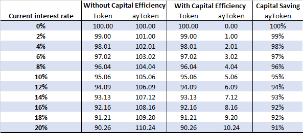

# Automated Market Making designed for lending protocols

Yield Token Pool facilitates trading of between Yield Token and its base Token, and uses an AMM logic similar to [Yield Space](https://yield.is/YieldSpace.pdf), but suitably modified to allow for capital efficiency from liquidity provision perspective.

The AMM formula is constructed such that its liquidity distribution is optimal for the trading between Yield Token and its base Token, hence allowing a better fungibility between Pool Tokens, i.e. the token representing the proportional ownership of the pool. ALEX does not at the moment support a custom liquidity provision \(except for the limit orders\).

The key of the AMM is **invariant function**, as it dynamically adjusts the price and the balances of Token and ayToken. As described in [Yield Space](https://yield.is/YieldSpace.pdf), invariant function is solution to the differential equation $$-\frac{dy}{dx}=\left(\frac{y}{x} \right)^t$$. $$y$$and $$x$$can then be solved and expressed as ****$$x^{1-t}+y^{1-t}=L$$ .

## **Trading Formula**

The market transaction, which involves exchange of Token and ayToken, satisfies the invariant function. Fee is not returned to the pool, therefore $$k$$remains constant.

### Out-Given-In

In order to purchase $$\Delta y$$ayToken from the pool, the buyer needs to deposit $$\Delta x$$Token, which can be expressed as 

$$\Delta y=y-\left[x^{1-t}+y^{1-t} - (x+\Delta x)^{1-t}\right]^{\frac{1}{1-t}}$$

### **In-Given-Out**

This is the opposite case to Out-Given-In. We are expressing $$\Delta x$$as a function of $$ \Delta y $$

$$\Delta x=  \left[x^{1-t}+y^{1-t} - (y-\Delta y)^{1-t}\right]^{\frac{1}{1-t}}-x $$

### In-Given-Price/Yield

Sometimes trader would like to adjust the price, perhaps due to deviation of AMM price to the market value. Denote $$p=\left( \frac{y}{x}\right)^t$$and $$p'=\left( \frac{y-\Delta y}{x + \Delta x}\right)^t$$pool price before and after the adjustment respectively,  we can then express $$\Delta x$$as

$$\Delta x=x\left[\left(\frac{1+p^{\frac{1-t}{t}}}{1+p'^{\frac{1-t}{t}}}\right)^{\frac{1}{1-t}}-1\right]$$

Under continuous compounding, where $$ p=e^{rt}$$, $$ p'=e^{r't}$$and $$r$$ and $$r'$$ are the corresponding interest rate, we can then express$$\Delta x$$as a function of $$r$$ and $$r'$$

$$\Delta x=x\left[\left(\frac{1+e^{r(1-t)}}{1+e^{r'(1-t)}}\right)^{\frac{1}{1-t}}-1\right]$$

## Capital Efficiency - Concentrated Liquidity

This is to allow liquidity to be concentrated on a fraction of the interest rate curve, rather than $$- \infty$$ to $$+ \infty$$. A typical example is to set the floor to $$ 0\% $$ so that negative interest rate is not permitted. Inspired by Uniswap V3. Concentrated liquidity is achieved by introducing virtual tokens to satisfy the invariant function  $$(x+x_v)^{1-t}+(y+y_v)^{1-t}=L$$, where $$x_v$$and $$y_v$$are virtual balance of Token and ayToken respectively. As a result, actual balance of Token/ayToken that liquidity providers are required to maintain is reduced by $$x_v$$/$$y_v$$. 

Levels of $$x_v$$ and $$y_v$$ are related to the interest rate bounds imposed to the liquidity pool. Assume that the lower/upper interest rate bound is$$r_l$$/$$r_u$$. When interest rate falls out of the range $$[ r_l , r_u ]$$, only one token exists and the liquidity pool trading function ceases to operate. Virtual balance can then be expressed as $$x_v=\left [ \frac{L}{1+e^{(1-t)r_u}} \right ]^{\frac{1}{1-t}}$$and $$y_v=\left [ \frac{L}{1+e^{-(1-t)r_l}} \right ]^{\frac{1}{1-t}}$$

### Example: Floor of $$0\%$$

Set $$t=0.5$$and $$L=20$$. In this case, virtual ayToken $$y_v$$is $$100$$. Assuming the current interest rate 10%, liquidity provider only needs to hold minimum $$5.06$$ fyTokens. Any larger amount would not be touched, as they would send the rate to negative territory. This is in contrast with$$105.06$$fyTokens without virtual reserve - a capital saving of 95%!

