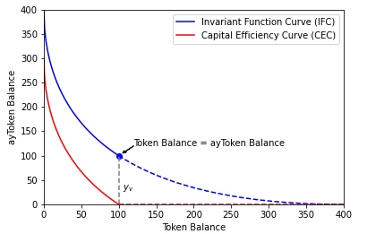
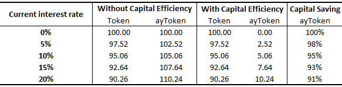

# Yield Token Pool

Please refer to our [white paper](../whitepaper/automated-market-making-of-alex.md) for a more rigorous treatment on the subject.

## Lending and Borrowing Process

ALEX's core product is essentially a zero coupon bond in conventional finance. A key benefit is reduced uncertainty about a loan's interest rate, resulting in better financial planning. Specifically, prior to entering a loan contract, borrowers and lenders secure the loan's interest rate and tenor on ALEX.

Here is a concrete example. Rachel has 100 USD. She wants to increase her 100USD. She chooses to lend her assets out. She's ok with lending out her 100USD for a fixed term of three months. She goes to ALEX's interface. There, Rachel can see that "three month ayUSD" is currently priced at 0.9 vs USD. Put simply, 1 ayUSD gets her 0.9 USD. She takes her 100 USD and exchanges it for ayUSD. Given the current exchange rate, she gets about 110 ayUSD. Now she waits. Three months pass. Now, Rachel can exchange her 110ayUSD for USD again. The rate is 1 ayUSD to 1 USD. So Rachel gets 110 USD. That's a gain of 10 USD over 3 months. Pretty nice!

Here is the general story. Borrowers and lenders enter a loan contract. Specifically, they swap a forward contract based token called "ayToken" with "Token". "Token" is the underlying asset. For example, they swap ayUSD with USD. More generally, the lender lends out "Tokens" and obtains "ayToken" in return. The price of "Token" is lower than its par value. The contract starts when a lender deposits "Token" in an ALEX pool. Then, upon expiration, the lender redeems the underlying asset, "Token", at par value. Because the lender lent out their "Token" at discounted price some time ago, and now redeems "Token" for par value, there is a price. Pretty nice!

In mathematical terms, the interest rate r is calculated as $$p_{t}=\frac{1}{e^{rt}}$$, where $$p_{t}$$ is the spot price of ayToken and the interest rate is assumed to compound. The formula utilises one of the most fundamental principles in asset pricing: an asset's present value is the asset's discounted future value. Thus, in our simplified example, $$t$$= 1 and $$r=\log\frac{1}{0.9}\approx10\%$$.

## Automated Market Making \(AMM\) Protocol

When designing the AMM protocol, ALEX believes the following:

1. AMMs are mathematically neat and reflect economic demand and supply. For example, price should increase when demand is high or supply is low; 
2. AMMs are a type of mean, which remains constant during trading activities. This approach is also adopted by popular platforms such as _Uniswap,_ which employ algorithmic means; and 
3. AMMs can be interpreted through the lens of modern finance theory. Doing so enables ALEX to grow and draw comparisons with conventional finance.

After extensive research, our beliefs led us to an AMM first proposed by _YieldSpace_. While we appreciate the mathematical beauty of their derivation, we adapt it in several ways with _ALEX_. For example, we replace a simple interest rate with a compounding interest rate. This change is in line with standard uses in financial pricing and modelling since Black and Scholes. We also develop a new capital efficiency scheme, as explained below.

In mathematical terms, our AMM can be expressed as:

$$
x^{1-t}+y^{1-t}=L
$$

where $$x$$, $$y$$, $$t$$ and $$L$$ are, respectively, the balance of "Token", balance of "ayToken", time to maturity and a constant term when $$t$$ is fixed. The interest rate $$r$$ is defined as $$r=\log\left(\frac{y}{x}\right)$$, i.e. the natural logarithm of the ratio of balance between "ayToken" and "Token", while the price of "ayToken" with respect to "Token" is $$\left(\frac{y}{x}\right)^{t}$$.

Our design depicts an AMM in the of a form of a generalised mean. It makes economic sense because the shape of the curve is decreasing and convex. It incorporates time to maturity $$t$$, which is explicitly built-in to derive ayToken's spot price. We refer readers to our [white paper](../whitepaper/automated-market-making-of-alex.md) for detail.

## Liquidity Providers \(LP\) and Capital Efficiency

LPs deposit both ayToken and Token in a pool to facilitate trading activities. LPs are typically ready to market-make on all possible scenarios of interest rate movements ranging from $$-\infty$$ to $$+\infty$$. However, part of the interest rates curve or movements will never be considered by market participants. On example is the part where the interest rate is negative. Although negative rates can be introduced in the fiat world by central bankers as monetary policy tool, yield farmers in the crypto world are still longing everything to be positive. In ALEX, positive rate refers to spot price of ayToken not exceeding 1 and ayToken reserve is larger than Token.

Inspired by _Uniswap v3_, ALEX employs virtual tokens - part of the assets that will never be touched, hence is not required to be held by LP.

Figure 1 illustrates an example of adopting virtual tokens in the event of positive interest rate. The blue line is the standard AMM. The blue dot marks an equal balance of Token and ayToken of $$y_{v}$$, meaning there is no, or a 0%, interest rate. $$y_{v}$$ is the boundary amount, as any amount lower than it will never be touched by LP to avoid negative rate, which is represented by blue dashed line. Thus, $$y_{v}$$ is virtual token reserve. Effectively, LP is market-making on the red line, which shifts the blue line lower by $$y_{v}$$. When ayToken is depleted as shown by red dashed line, trading activities are suspended.

A numerical example provided in Table 1 shows capital efficiency with respect to various interest rate, assuming $$t$$= 0.5 and $$L$$= 20 for illustration's sake.  When the current interest rate$$r$$= 10%, LPs are required to deposit 95 token and 105 ayToken according to standard AMM. However, if the interest rate is floored at 0%, LP only needs to contribute 5 ayToken, as the rest 100 ayToken would be virtual. This is a decent saving more than 90%.

## Yield Curve and Yield Farming

By expressing the interest rate as $$p_{t}=\frac{1}{e^{rt}}$$, i.e. $$r=-\frac{1}{t}\log p_{t}$$, we can obtain a series of interest rates from trading pool prices with respect to various maturities, based on which we are able to build a yield curve. The Yield curve is the benchmark tool for modelling risk-free rates in conventional finance. The shape of the curve dictates expectations about future interest rate path, which helps market participants understand market behaviours and trends. Currently we might be able to build a Bitcoin yield curve from Bitcoin futures listed on the Chicago Mercantile Exchange \(CME\). However, not only is the exchange heavily regulated, its trading volume is skewed to the very short dated front end contracts lasting several months only. ALEX aims to offer future contracts up to 1y when the platform goes live. Should markets mature, ALEX may extend to longer tenors.

Yield farmers can benefit from understanding the yield curve by purchasing ayToken whose tenor corresponds to high interest rates and selling ayToken whose tenor associates with low interest rates. This is a typical “carry" strategy.

Last but not least, based on the development of the yield curve and solid design work of our AMM, ALEX will be able to provide more products. Specifically, ALEX will be able to offer derivatives, including options and structured products, building on and extending a large amount of literatures and applications in conventional finance.

